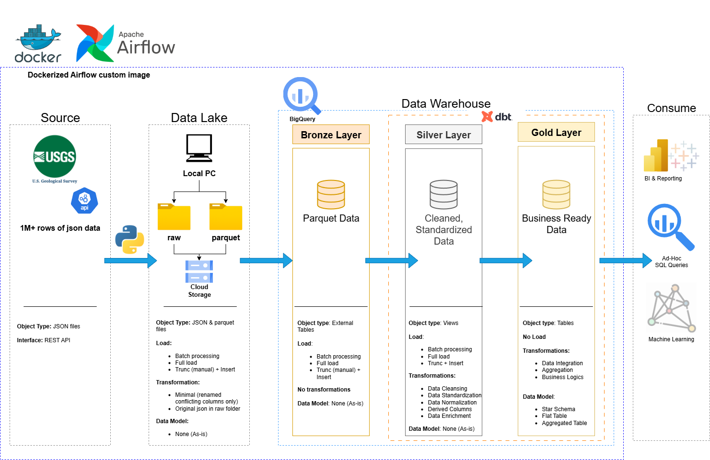

# de_project_usgs_earthquakes

## Project Overview
The core objective of this project is to create a reliable and scalable workflow for earthquake data. This involves:
- **Automated Data Ingestion**: Regularly fetching raw earthquake data from the USGS API.
- **Data Storage**: Storing both raw and processed data efficiently in cloud storage.
- **Data Transformation**: Structuring and cleaning the data into a usable format for analysis.
- **Data Warehousing**: Loading transformed data into a cloud data warehouse for querying and reporting.
- **Data Visualization**: Summarizing data and information into trends and charts.

---
## 🏗️ Data Architecture
The data architecture for this project follows Medallion Architecture Bronze, Silver, and Gold layers:

---

## 🧰 Tech Stack
- **USGS Earthquake Data API**: The primary data source, providing real-time and historical earthquake information. This is a REST API, allowing for programmatic access to the data.
- **Apache Airflow**: The central orchestration platform. Airflow schedules and manages the entire data pipeline, ensuring tasks run in the correct order, handling retries, and providing monitoring capabilities.
- **Google Cloud Storage (GCS)**: Used for data landing and staging. Raw JSON data and intermediate Parquet files are stored here before being loaded into BigQuery.
- **Google BigQuery**: A fully managed, serverless data warehouse. BigQuery stores the structured data, enabling fast analytical queries. It's organized into bronze, silver, and gold layers to reflect data maturity.
- **dbt (data build tool)**: Employed for data transformation and modeling within BigQuery. dbt allows for SQL-based transformations, version control of data models, and automated testing, ensuring data quality and consistency across the silver and gold layers.
- **Docker & Docker Compose**: Used to containerize the Airflow environment, providing a consistent and isolated development and deployment setup.
