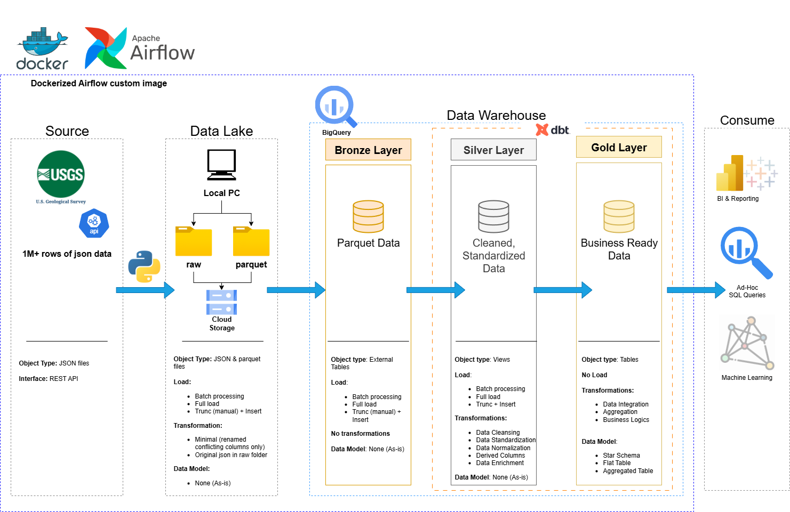

# de_project_usgs_earthquakes

## Project Overview
The core objective of this project is to create a reliable and scalable workflow for earthquake data. This involves:
- **Automated Data Ingestion**: Regularly fetching raw earthquake data from the USGS API.
- **Data Storage**: Storing both raw and processed data efficiently in cloud storage.
- **Data Transformation**: Structuring and cleaning the data into a usable format for analysis.
- **Data Warehousing**: Loading transformed data into a cloud data warehouse for querying and reporting.
- **Data Visualization**: Summarizing data and information into trends and charts using a business intelligence tool.

---
## 🏗️ Data Architecture
The data architecture for this project follows Medallion Architecture **Bronze**, **Silver**, and **Gold** layers:


1. **Bronze**: The Bronze layer serves as the raw data landing zone. It holds external tables in BigQuery that link directly to data in GCS buckets. Raw JSON files from the API are stored in a raw folder, and after conversion, optimized Parquet files are placed in a parquet folder.
2. **Silver**: This layer includes data cleansing, standardization, and normalization process to prepare data for analysis.
3. **Gold**: Houses business-ready data modeled into a star schema required for reporting and analytics.

---

## 🧰 Tech Stack
- **USGS Earthquake Data API**: The primary data source, providing real-time and historical earthquake information. This is a REST API, allowing for programmatic access to the data.
- **Apache Airflow**: The central orchestration platform. Airflow schedules and manages the entire data pipeline, ensuring tasks run in the correct order, handling retries, and providing monitoring capabilities.
- **Google Cloud Storage (GCS)**: Used for data landing and staging. Raw JSON data and intermediate Parquet files are stored here before being loaded into BigQuery.
- **Google BigQuery**: A fully managed, serverless data warehouse. BigQuery stores the structured data, enabling fast analytical queries. It's organized into bronze, silver, and gold layers to reflect data maturity.
- **dbt (data build tool)**: Employed for data transformation and modeling within BigQuery. dbt allows for SQL-based transformations, version control of data models, and automated testing, ensuring data quality and consistency across the silver and gold layers.
- **Docker & Docker Compose**: Used to containerize the Airflow environment, providing a consistent and isolated development and deployment setup.
- **Microsoft Power BI**: A powerful business intelligence (BI) tool used for data visualization and interactive dashboards. It connects directly to the curated data in BigQuery's gold layer to provide insights and reporting.
- **Notion**: Utilized for project planning, task management, and documentation. It serves as a central hub for outlining project requirements, tracking progress, and organizing key information. [Notion Project Steps](https://prickle-philosophy-032.notion.site/Data-Engineering-Project-2384b48d6676803fb04ae585b070cf8d?source=copy_link)

---

## Data Pipeline Flow
The pipeline follows a typical Extract, Load, Transform (ELT) pattern:

1. **Extract (E)**: Airflow triggers a Python script to download raw earthquake data in JSON format from the USGS API.

2. **Load (L)** - Staging: The raw JSON files are organized into a structured directory (e.g., by year) and then uploaded to a designated "raw" bucket in GCS.

3. **Transform (T)** - Intermediate: The raw JSON files are converted into Parquet format, which is more efficient for columnar storage and analytical querying, and then uploaded to a "parquet" bucket in GCS.

4. **Load (L)** - Data Lake/Warehouse: BigQuery datasets (bronze, silver, gold) are created. An external table is established in the bronze layer, pointing directly to the Parquet files in GCS, acting as a raw data lake layer.

5. **Transform (T)** - Modeling: dbt is used to build and test data models. It transforms the raw data from the bronze layer into cleaned, structured tables in the silver layer, and then aggregates/prepares data for analytical use cases in the gold layer.

This project demonstrates a robust, cloud-native approach to building a scalable and maintainable data pipeline for analytical purposes.

---

## 📂 Repository Structure
```
de_project_usgs_earthquakes/
├───airflow/
│   ├───.dbt/                                     # create this folder and put your profiles.yml here
│   ├───.gcp/                                     # create this folder and put your gcp json key here
│   ├───config/                                   # create this folder (required by airflow)
│   ├───dags/                                     # create this folder (required by airflow)
│   │   └───data_pipeline_dag.py                  # airflow dag for this project
│   ├───data/                                     # create this folder (required for data storage)
│   ├───dbt/                                      # dbt project folder, created with dbt init
│   │   ├───analyses/
│   │   ├───macros/
│   │   │   ├───get_custom_schema.sql             # without this file, your bigquery dataset name will concat with another dataset name that you set in profile.yml
│   │   │   └───test_no_whitespace.sql            # a commonly-needed test but dbt didn't have it
│   │   ├───models/
│   │   │   ├───gold/                             # contain the sql model file written to transform the data in the silver later
│   │   │   │   ├───dim_alert.sql
│   │   │   │   ├───dim_date.sql
│   │   │   │   ├───dim_event_type.sql
│   │   │   │   ├───dim_magnitude_method.sql
│   │   │   │   ├───dim_network.sql
│   │   │   │   ├───dim_status.sql
│   │   │   │   ├───fact_earthquakes.sql
│   │   │   │   └───schema.yml                    # contain descriptions and tests for each column of all the models in the folder
│   │   │   ├───silver/                           # contain the sql model file written to transform the data in the bronze/source later
│   │   │   │   ├───usgs_earthquakes_cleaned.sql
│   │   │   │   └───schema.yml
│   │   ├───seeds/                                # empty, you can put small constant/reference files here 
│   │   ├───snapshots/
│   │   ├───tests/
│   │   │   ├───assert_id_format.sql              # these tests are more specfic than the general tests used in the macro folder 
│   │   │   └───assert_title_format.sql
│   ├───logs/                                     # create this folder (required by airflow)
│   ├───plugins/                                  # create this folder (required by airflow)
│   ├───scripts/                                  # all the python and bash scripts used in the dag are from here
│   │   ├───1_download_earthquake_data.py
│   │   ├───2_organize_data_raw.sh
│   │   ├───3_upload_json_to_gcs.sh
│   │   ├───4_convert_to_parquet.py
│   │   ├───5_organize_data_parquet.sh
│   │   ├───6_upload_parquet_to_gcs.sh
│   │   ├───7_create_bq_datasets.sh
│   │   └───8_create_bq_bronze_table.sh
├───BI/                                           # contain the pbit file exported from power BI desktop
├───docs/
│   ├───drawio/                                   # contain drawio file made for this project
│   │   ├───data_architecture.drawio
│   │   └───data_model.drawio
│   ├───ico/                                      # contain some icon used when making drawio file
│   ├───png/                                      # contain some screenshots from bigquery, dbt, cloud storage, airflow, and drawio file.
│   ├───data_dictionary.md                        # description of all the columns in this project copied from official source
│   └───naming_conventions.md                     # some sets  of rules on naming files and tables for this project
└───project workbook.ipynb                        # project workbook, all the scripts before dbt were written and tested here first before writing them into scripts folder
```

## 🚀 Getting Started: Duplicate This Project Locally
This project is designed to be easily reproducible using Docker and Docker Compose. Follow these steps to set up and run the entire data pipeline on your local machine.

### Prerequisites
Before you begin, ensure you have the following installed on your system:
- **Git**: For cloning the repository.
- **Docker Desktop**: Includes Docker Engine and Docker Compose.
- **Google Cloud SDK**: Essential for authenticating with GCP, managing projects, and using gsutil.

### Setup Steps
1. Clone the Repository
2. Setup Google Cloud Platform (GCP). You need to have the following:
  - GCP Project
  - Service Account that have permission `BigQuery Data Editor`, `BigQuery Job User`, `BigQuery User`, `Storage Admin`, `Storage Object Creator` (these were what I used), then download the key as json.
  - Google Cloud Storage (GCS) Bucket and then create two folder (raw & parquet) in the bucket.
  - BigQuery Datasets (while we will create bronze, silver and gold, we need to create one for dbt to test connection to bigquery)

## 🛡️ License

This project is licensed under the [MIT License](LICENSE). You are free to use, modify, and share this project with proper attribution.
